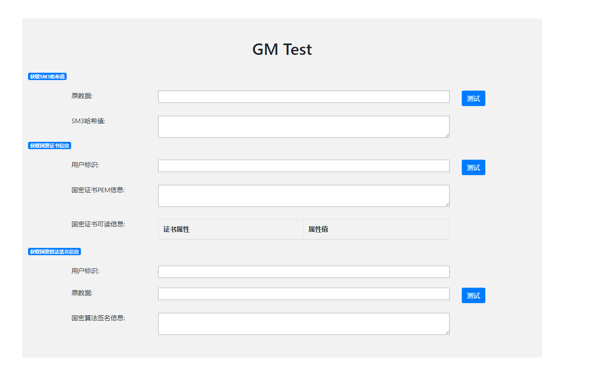

## 国密算法集成说明
目前在RCNode的crypto方法集（RCNode/src/crypto.js）中集成了由中宇万通提供的基于Websocket API服务的国密算法。

主要集成了以下内容：
- sm3哈希值获取
- sm2证书生成
- sm2数字签名
*************************
### 集成国密算法后的方法使用说明
#### 安装与配置国密算法服务
1. 在windows环境下，双击运行TrustMoreBlockChain_Setup.exe安装程序，安装好websocketgmapi服务
2. 在windows环境下，双击运行CertManager/start.bat程序，开启sm2证书管理服务
3. 在websocketgmapi服务被安装在的目标目录下（默认为C:\Program Files (x86)\TrustMore）更改websocketclient.cfg配置文件，使该文件内容如下：
    ```
    127.0.0.1
    6089
    ```
4. 重启websocketgmapi服务：在websocketgmapi服务被安装在的目标目录下（默认为C:\Program Files (x86)\TrustMore）双击websocketgmapi.exe程序

#### 测试集成国密算法后的方法
目前对集成国密算法后的方法的使用，只支持在**websocketgmapi服务所在计算机本地的chrome浏览器上**进行
1. 使用chrome浏览器打开RCNode/test/testgm.html页面（testgm.html将加载已编译好的文件RCNode/test/testgm.bundle.js，该文件由使用browserify对RCNode/test/testgm.js编译而来，具体命令为`browserify testgm.js -o testgm.bundle.js`）
2. 可对以下集成国密算法后的方法进行测试：
    - GetHashVal()
    - CreateCertificate()
    - Sign()
>> Note: 第一次调用方法需要建立wss连接，耗时较长

3. 上述集成国密算法后的方法接口描述可参考[RCNode/doc/global.html](global.html)，其使用可参考[RCNode/test/testgm.js](../test/testgm.js)